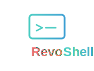

<p align="center">
  
</p>

<p align="center">
  <strong>A secure reverse-shell orchestration hub for managing remote devices</strong>
</p>


## How it works

RevoShell uses a client-server architecture with three main components:

### Architecture Overview

1. **Server** - The central hub that orchestrates all connections
   - Run the server on a machine accessible to your agents (e.g., a cloud server, local machine, or VPS)
   - The server listens for incoming WebSocket connections from agents
   - Acts as a router between client commands and remote agents
   - Can handle thousands of simultaneous agent connections

2. **Agents** - The workers running on remote devices
   - Install and run agents on the devices you want to manage
   - Each agent establishes a persistent WebSocket connection to the server
   - Agents automatically reconnect if the connection drops
   - Multiple agents can connect to a single server

3. **Client Commands** - Your control interface
   - Use CLI commands to interact with connected agents through the server
   - No direct connection to agents needed - all communication goes through the server
   - Commands include: shell access, file transfer, device listing, and session management

### Typical Workflow

```
┌─────────────────────────────────────────────────────────────────┐
│ 1. Start the Server                                             │
│    $ revoshell server --addr 0.0.0.0:8080                       │
│    Server is now listening for agent connections...             │
└─────────────────────────────────────────────────────────────────┘
                              ▼
┌─────────────────────────────────────────────────────────────────┐
│ 2. Connect Agents from Remote Devices                           │
│    Device A: $ revoshell agent --server ws://server:8080/ws     │
│    Device B: $ revoshell agent --server ws://server:8080/ws     │
│    Agents are now connected and ready to receive commands...    │
└─────────────────────────────────────────────────────────────────┘
                              ▼
┌─────────────────────────────────────────────────────────────────┐
│ 3. Manage Devices from Anywhere                                 │
│                                                                 │
│    • List connected devices:                                    │
│      $ revoshell devices --server ws://server:8080/ws           │
│                                                                 │
│    • Open interactive shell on Device A:                        │
│      $ revoshell connect device-a --server ws://server:8080/ws  │
│                                                                 │
│    • Download file from Device B:                               │
│      $ revoshell download device-b /path/to/file.txt \          │
│        --server ws://server:8080/ws                             │
│                                                                 │
│    • Upload file to Device A:                                   │
│      $ revoshell upload device-a local.txt /remote/path.txt \   │
│        --server ws://server:8080/ws                             │
└─────────────────────────────────────────────────────────────────┘
```

### Key Features

- **Reverse Connection**: Agents initiate connections to the server, making it work through NAT/firewalls
- **Persistent Sessions**: Multiple interactive shell sessions can run simultaneously on different agents
- **Secure Communication**: Optional TLS encryption and authentication via security keys
- **Real-time Interaction**: Full terminal support with proper PTY handling for interactive commands
- **File Transfer**: Efficient binary-safe file uploads and downloads with permission preservation
- **Auto-Reconnection**: Agents automatically reconnect with exponential backoff if disconnected

## Installation

### Pre-built Binaries

Download the latest release for your platform from the [GitHub Releases](https://github.com/danielgatis/revoshell/releases) page. Pre-compiled binaries are available for:

- Linux (amd64, arm64, arm)
- macOS (amd64, arm64)
- Windows (amd64, arm64)
- FreeBSD (amd64, arm64)

Simply download the archive corresponding to your operating system and architecture, extract it, and move the binary to a location in your PATH:

```bash
# Example for Linux/macOS
tar -xzf revoshell_*.tar.gz
sudo mv revoshell /usr/local/bin/
```

### Install via Go

```bash
go install github.com/danielgatis/revoshell@latest
```

### Build from Source

```bash
git clone https://github.com/danielgatis/revoshell.git
cd revoshell
make build
```

## Usage

### 1. Start the Server

Start a WebSocket server to accept agent connections:

```bash
# Start server on default address (localhost:8080)
revoshell server

# Start server on custom address
revoshell server --addr 0.0.0.0:9090

# Start server with authentication
revoshell server --addr localhost:8080 --security-key "your-secret-key"

# Start server with TLS/SSL
revoshell server --addr localhost:8443 --tls-cert /path/to/cert.pem --tls-key /path/to/key.pem
```

**Options:**
- `--addr, -a`: Address to listen on in host:port format (default: localhost:8080)
- `--security-key, -k`: Security key for authentication (optional)
- `--tls-cert, -c`: Path to TLS certificate file (enables WSS)
- `--tls-key, -t`: Path to TLS private key file (enables WSS)

### 2. Start an Agent

Connect an agent to the server:

```bash
# Connect to server with auto-generated ID
revoshell agent --server ws://localhost:8080/ws

# Connect with custom agent ID and name
revoshell agent --server ws://localhost:8080/ws --id my-laptop --name "Development Laptop"

# Connect with authentication
revoshell agent --server ws://localhost:8080/ws --security-key "your-secret-key"

# Connect to TLS server (skip certificate verification for self-signed certs)
revoshell agent --server wss://server.example.com:8443/ws --tls-insecure
```

**Options:**
- `--server, -s`: WebSocket server URL (default: ws://localhost:8080/ws)
- `--id, -i`: Agent ID (optional, auto-generated if not provided)
- `--name, -n`: Agent name (optional)
- `--security-key, -k`: Security key for authentication (optional)
- `--tls-insecure`: Skip TLS certificate verification (for self-signed certs)

### 3. List Connected Devices

View all agents currently connected to the server:

```bash
# List all connected devices
revoshell devices --server ws://localhost:8080/ws

# List devices with authentication
revoshell devices --server ws://localhost:8080/ws --security-key "your-secret-key"
```

**Example output:**
```
Connected Devices:
ID              Name                    Sessions
my-laptop       Development Laptop      2
production-01   Production Server       0
iot-device-01   IoT Device #1          1
```

**Options:**
- `--server, -s`: WebSocket server URL (default: ws://localhost:8080/ws)
- `--security-key, -k`: Security key for authentication (optional)

### 4. Connect to an Agent Shell

Start an interactive shell session with a remote agent:

```bash
# Connect to agent with default shell (/bin/bash)
revoshell connect <agent-id> --server ws://localhost:8080/ws

# Connect with custom shell
revoshell connect my-laptop --server ws://localhost:8080/ws --shell /bin/zsh

# Connect with authentication
revoshell connect production-01 --server ws://localhost:8080/ws --security-key "your-secret-key"
```

**Example:**
```bash
revoshell connect my-laptop --server ws://localhost:8080/ws
# You're now in an interactive shell on the remote agent
$ ls -la
$ cd /var/log
$ cat syslog
$ exit  # or Ctrl+D to disconnect
```

**Options:**
- `--server, -s`: WebSocket server URL (default: ws://localhost:8080/ws)
- `--security-key, -k`: Security key for authentication (optional)
- `--shell`: Shell to use (default: /bin/bash)

### 5. List Active Sessions

View all active shell sessions:

```bash
# List all sessions
revoshell sessions --server ws://localhost:8080/ws

# List sessions with authentication
revoshell sessions --server ws://localhost:8080/ws --security-key "your-secret-key"
```

**Example output:**
```
Active Sessions:
Session ID                            Agent ID
session-abc123                        my-laptop
session-def456                        production-01
session-ghi789                        my-laptop
```

**Options:**
- `--server, -s`: WebSocket server URL (default: ws://localhost:8080/ws)
- `--security-key, -k`: Security key for authentication (optional)

### 6. Disconnect from Agent

Terminate an active session:

```bash
# Disconnect a specific session
revoshell disconnect <session-id> --server ws://localhost:8080/ws

# Disconnect with authentication
revoshell disconnect session-abc123 --server ws://localhost:8080/ws --security-key "your-secret-key"
```

**Options:**
- `--server, -s`: WebSocket server URL (default: ws://localhost:8080/ws)
- `--security-key, -k`: Security key for authentication (optional)

### 7. Download Files from Agent

Download a file from a remote agent:

```bash
# Download file
revoshell download <agent-id> <remote-path> --server ws://localhost:8080/ws

# Download with custom output path
revoshell download my-laptop /etc/hosts --output ./hosts-backup --server ws://localhost:8080/ws

# Download with authentication
revoshell download production-01 /var/log/app.log --server ws://localhost:8080/ws --security-key "your-secret-key"
```

**Example:**
```bash
# Download remote file to current directory
revoshell download my-laptop /home/user/document.txt --server ws://localhost:8080/ws

# Download with custom name
revoshell download my-laptop /etc/nginx/nginx.conf --output nginx-backup.conf --server ws://localhost:8080/ws
```

**Options:**
- `--server, -s`: WebSocket server URL (default: ws://localhost:8080/ws)
- `--security-key, -k`: Security key for authentication (optional)
- `--output, -o`: Local output path (default: uses remote filename)

### 8. Upload Files to Agent

Upload a file to a remote agent:

```bash
# Upload file
revoshell upload <agent-id> <local-path> <remote-path> --server ws://localhost:8080/ws

# Upload with custom permissions
revoshell upload my-laptop ./script.sh /tmp/script.sh --mode 0755 --server ws://localhost:8080/ws

# Upload with authentication
revoshell upload production-01 ./config.yaml /etc/app/config.yaml --server ws://localhost:8080/ws --security-key "your-secret-key"
```

**Example:**
```bash
# Upload local file to remote agent
revoshell upload my-laptop ./backup.tar.gz /tmp/backup.tar.gz --server ws://localhost:8080/ws

# Upload executable script with execute permissions
revoshell upload my-laptop ./deploy.sh /opt/scripts/deploy.sh --mode 0755 --server ws://localhost:8080/ws
```

**Options:**
- `--server, -s`: WebSocket server URL (default: ws://localhost:8080/ws)
- `--security-key, -k`: Security key for authentication (optional)
- `--mode, -m`: File permissions in octal format (default: 0644)

## Running as a System Service

For production deployments, it's recommended to run both the server and agents as systemd services. This ensures automatic startup on boot, proper process management, and enhanced reliability.

### Server Systemd Service

Create a systemd service file for the server at `/etc/systemd/system/revoshell-server.service`:

```ini
[Unit]
Description=RevoShell Server - Remote Device Orchestration Hub
After=network.target
Wants=network-online.target

[Service]
Type=simple
WorkingDirectory=/opt/revoshell
ExecStart=/usr/local/bin/revoshell server --port 8080 --security-key "your-secret-key"
Restart=always
RestartSec=10

[Install]
WantedBy=multi-user.target
```

**Enable and start the service:**

```bash
# Install the binary
sudo cp revoshell /usr/local/bin/
sudo chmod +x /usr/local/bin/revoshell

# Enable and start the service
sudo systemctl daemon-reload
sudo systemctl enable revoshell-server
sudo systemctl start revoshell-server

# Check status
sudo systemctl status revoshell-server
```

### Agent Systemd Service

Create a systemd service file for each agent at `/etc/systemd/system/revoshell-agent.service`:

```ini
[Unit]
Description=RevoShell Agent - Remote Management Client
After=network.target
Wants=network-online.target

[Service]
Type=simple
User=root
ExecStart=/usr/local/bin/revoshell agent \
  --server ws://your-server:8080/ws \
  --security-key "your-secret-key" \
  --name "%H - Production Agent"
Restart=always
RestartSec=10

[Install]
WantedBy=multi-user.target
```

**Enable and start the agent:**

```bash
# Install the binary
sudo cp revoshell /usr/local/bin/
sudo chmod +x /usr/local/bin/revoshell

# Enable and start the service
sudo systemctl daemon-reload
sudo systemctl enable revoshell-agent
sudo systemctl start revoshell-agent

# Check status
sudo systemctl status revoshell-agent

# View logs
sudo journalctl -u revoshell-agent -f
```

## Configuration File

You can create a configuration file to avoid specifying flags every time. RevoShell looks for `config.yaml` in:

1. Current directory (./config.yaml)
2. User home directory (~/.revossh/config.yaml)
3. System directory (/etc/revossh/config.yaml)
4. XDG config directory ($XDG_CONFIG_HOME/revossh/config.yaml)

## Buy me a coffee

Liked some of my work? Buy me a coffee (or more likely a beer)

<a href="https://www.buymeacoffee.com/danielgatis" target="_blank"></a>

## License

Copyright (c) 2025-present [Daniel Gatis](https://github.com/danielgatis)

Licensed under [MIT License](./LICENSE.txt)
